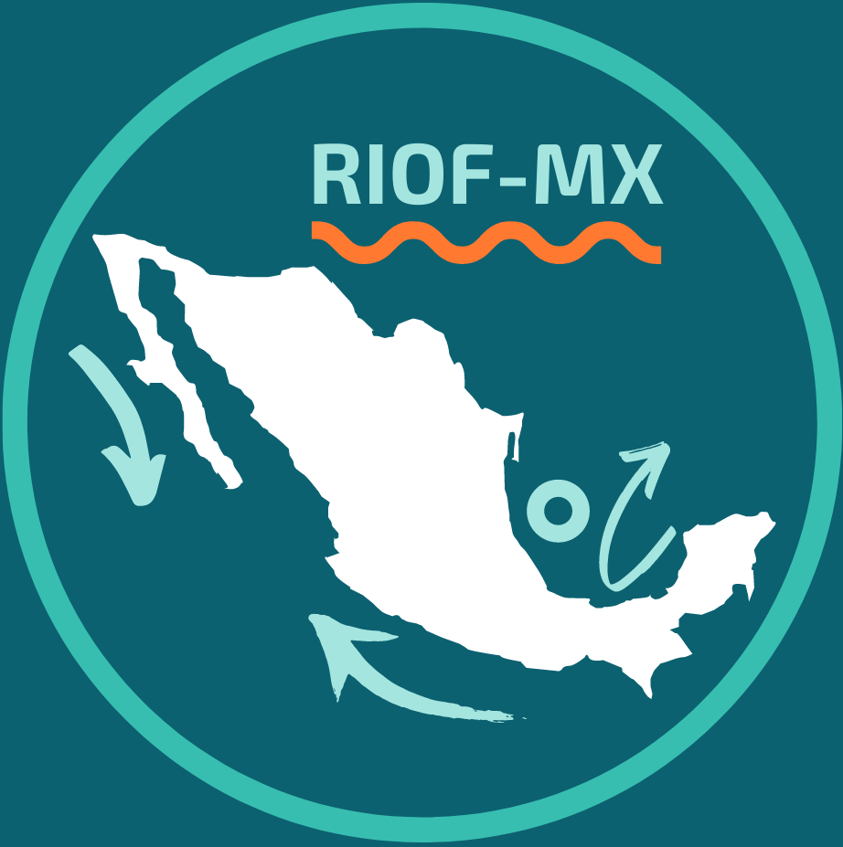

Esta red busca crear acercar a l@s investigador@s en oceanografía 
física y áreas afines con el propósito de promover y facilitar la colaboración 
entre distintos grupos del país. En particular, nos interesa funcionar como red de apoyo 
para l@s investigador@s que recién inician su carrera académica --como posdoctorantes, 
catedrátic@s e investigador@s-- dando a conocer su trabajo y creando espacios para colaborar.

Si tienes comentarios, sugerencias o te interesa participar envíanos un correo.

 
### Organizadores:

[**Efraín Moreles**](https://www.icmyl.unam.mx/es/quienes_somos/personal_academico/moreles-vazquez-luis-efrain) 
Instituto de Ciencias del Mar y Limnología, UNAM 
correo

**Erick Raúl Olvera Prado** 
Centro de Ciencias de la Atmósfera, UNAM 
correo

[**Ana Karina Ramos Musalem**](https://anakarinarm.github.io)  
Centro de Ciencias de la Atmósfera, UNAM 
kramosmu@atmosfera.unam.mx
